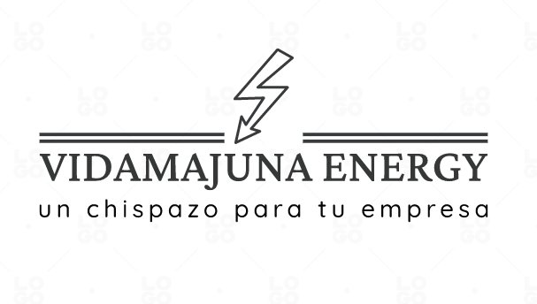
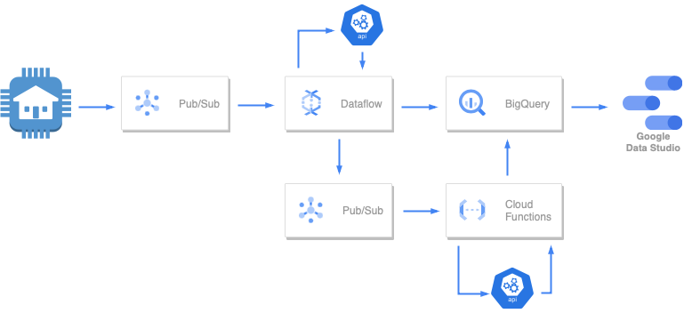

# VIDAMAJUNA

# Data Project 2
## Máster en Data Analytics - EDEM
### Curso 2022/2023

- [Victor Ruiz](https://www.linkedin.com/in/vruizext/)
- [Darío Fernández](https://www.linkedin.com/in/dar%C3%ADo-fern%C3%A1ndez-fern%C3%A1ndez/)
- [Marina Pérez](https://www.linkedin.com/in/marinaperezbarber/)
- [Julio Sahuqillo](https://www.linkedin.com/in/juliosahuquillohuerta/)
- [Nacho Pascual](https://www.linkedin.com/in/nacho-pascual/)

# Proyecto
## Contexto
EDEM ha creado el día 18 de Marzo un evento de lanzamiento de empresas con productos IoT. Es vuestro momento! En este evento podréis presentar vuestro producto IoT como SaaS. Durante estas tres semanas, debéis pensar un producto IoT, desarrollarlo y simular su uso. Este proyecto debe tener una arquitectura escalable pero no es obligatorio cloud, vosotros decidís. De cara a participar en este evento, vuestra solución debe ser escalable, opensource y cloud.

## ¿Qué es VIDAMAJUNA?

**VIDAMAJUNA** es una startup enfocada al ahorro energético para las oficinas.
 

# Tecnología
## Arquitectura

## Configuración del sistema

**PubSub**
En primer lugar, creamos dos Topics con sus respectivas suscripciones por defecto. 

-El topic **consumption** que utilizaremos para leer los datos de nuestros generadores que simulan los datos de clientes.
-El topic **alertas** en el que se volcará el output del dataflow que luego utilizaremos para las alertas .

**Cloud Storage**

Creamos un **bucket** único que luego utilizaremos para construir el Dataflow Flex Template.

**API**
 
 Hacemos el deploy de nuestra api en google cloud run mediante github accions a través de Terraform.

**DataFlow**

Lanzamos nuestro dataflow el cual ejecuta 2 rutas diferentes con nuestros datos:

1.La primera ruta, se encarga de coger los datos de nuestra cola de mensajes , añadirles la franja horaria y guardar los datos en la tabla de consumption.

2.La segunda ruta,se encarga de coger los datos de nuestra cola de mensajes y realizarles la tranformación pertinente para agregarlos por cliente y dispositivo, por ultimo guarda el mensaje en el topic alerta para posteriormente utilizarlo en la función.

**Cloud Functions**

Creamos una funcion llamada alerta que recibe los datos del tópico alerta en el que hemos volcado el output del dataflow, una vez tiene los datos les añade la franja de consumo mediante la api y ejecuta la lógica pertinente para determinar si el consumo es el aporpiado para el periodo.

**BigQuery**

En BigQuery se almacenarán los diferentes datos que empleamos en el proyecto, hemos creado un dataset llamado vidamajuna dodne se encuentra la tabla consumption y la tabla alertas.

1.La **Tabla consumption** recoge los datos del consumo de nuestros clientes
2.La **Tabla alertas**  recoge los datos transformados por nuestro dataflow y nos 

**Data Studio**

Finalmente, desde Data Studio se leen directamente los datos de BigQuery y se muestran en un dashboard interactivo.

**Video del funcionamiento**
